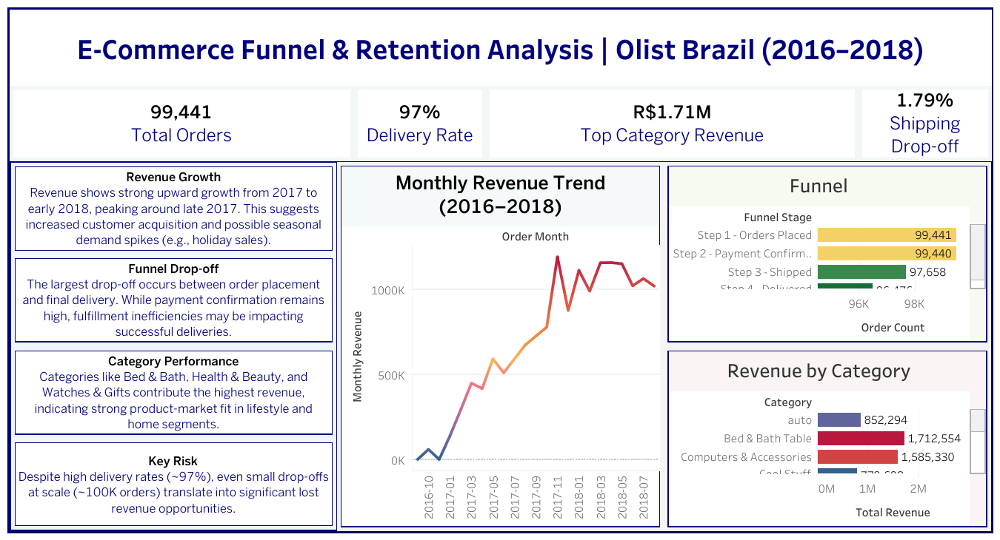
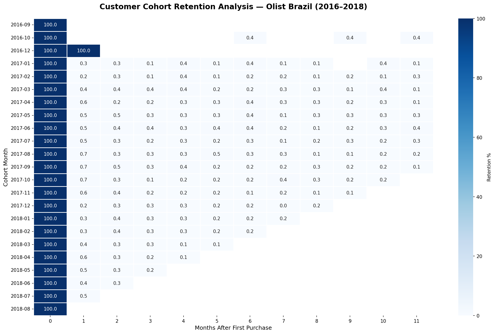

# 📊 Olist E-Commerce Funnel & Retention Analysis

## 🔍 Project Overview
Analyzed **100K+ real-world Brazilian e-commerce orders** to identify customer drop-off across the purchase funnel, evaluate cohort retention, and uncover revenue concentration patterns.

This project combines SQL, Python, and Tableau to transform raw transactional data into actionable business insights.

---

## 🎯 Objective
- Identify drop-off points across the purchase funnel  
- Analyze cohort retention trends (Month-2 focus)  
- Evaluate revenue concentration by category  
- Prioritize business recommendations using an impact vs effort framework  

---

## 🛠 Tools & Technologies
- **SQL (MySQL)**  
- **Python (pandas, seaborn, matplotlib)**  
- **Tableau Public**  

---

## 📁 Dataset
Olist Brazilian E-commerce Dataset (100K+ orders):  
👉 https://www.kaggle.com/datasets/olistbr/brazilian-ecommerce  

*Note: Raw datasets are not included due to size. The project uses processed data derived from this source.*

---

## 📊 Dashboard Preview

---

## 🔗 Live Dashboard
Explore the interactive dashboard:  

👉 https://public.tableau.com/views/OlistEcommerceFunnelAnalysisEshaSharma_17761702456240/Dashboard1?:language=en-US&:sid=&:display_count=n&:origin=viz_share_link  

💡 *Tip: Use filters and hover interactions to explore trends across time and product categories.*

---

## 📈 Key Findings
- **1.79% shipping-to-delivery drop-off** → ~1,200 lost orders at scale  
- **Month-2 retention ~30–35%** → heavy reliance on new customer acquisition  
- **Top categories (Bed & Bath & Health & Beauty)** drive 40%+ of total revenue  

---

## 💡 Business Recommendations

### 1. Improve Month-2 Retention (Quick Win)
- Automated post-purchase email campaigns  
- Personalized product recommendations  
👉 **Expected Impact:** +8–12% retention  

---

### 2. Optimize Final-Mile Delivery (Strategic)
- Audit logistics partners  
- Improve SLA enforcement  
👉 **Expected Impact:** Delivery rate increase (97% → 99%)  

---

### 3. Focus on High-Revenue Categories (Quick Win)
- Increase marketing spend on top-performing categories  
👉 **Expected Impact:** +15–20% category revenue growth  

---

## 📊 Cohort Analysis

Month-2 retention remains consistently low across all cohorts, indicating a critical opportunity to improve early lifecycle engagement.

---

## 📁 Project Structure

| File/Folder | Description |
|------------|------------|
| `README.md` | Project overview and insights |
| `funnel_analysis.sql` | SQL queries for funnel drop-off analysis |
| `cohort_analysis.ipynb` | Python notebook for cohort retention |
| `data_loading.ipynb` | Data cleaning and preprocessing |
| `Insight_document.pdf` | Final business insights and recommendations |
| `PROJECT_LINKS.md` | Quick access to dashboard & resources |
| `images/Dashboard.png` | Tableau dashboard preview |
| `images/cohort_heatmap.png` | Cohort retention heatmap |

---

## 📄 Resume Bullet
Analyzed 100K+ e-commerce orders using SQL and Python to identify funnel drop-offs across 4 stages; built an interactive Tableau dashboard and cohort retention model revealing ~30–35% month-2 churn; prioritized high-impact business recommendations using an impact vs effort framework.

---

## 👩‍💻 Author
**Esha Sharma**  
Business/Data Analyst Portfolio Project  
April 2026
